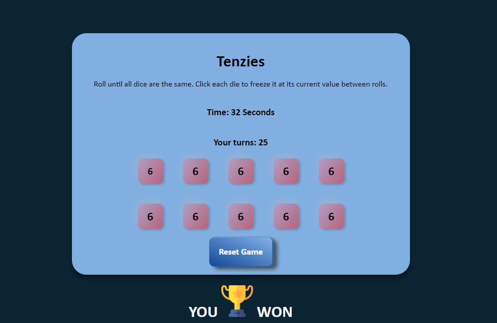

# Tenzies Game

Tenzies is a fast-paced dice game where players roll ten dice, aiming to get all dice to show the same number as quickly as possible

> The demo can be viewed [here](https://bilal4821.github.io/Tenzies-Game/)

## Technologies Used
- HTML
- CSS
- Javascript

## Features

- Players roll dice repeatedly to match all dice to the same number.
- Dice showing the desired number can be frozen to avoid rerolling.
- The goal is to match all dice as quickly as possible, adding excitement and competition.

## Preview 
